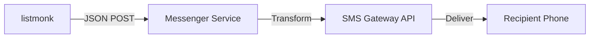

This guide explains the fundamental concepts and terminology used in listmonk.

## Subscriber

A subscriber is a recipient identified by an email address and name. Subscribers are the core entities that receive messages from listmonk.

### Key Characteristics

- **Unique by email**: Each email address represents one subscriber
- **Multiple list membership**: A subscriber can belong to multiple lists
- **Custom attributes**: Arbitrary data can be attached to each subscriber
- **Orphan handling**: Subscribers not in any lists are considered orphan records

### Attributes

Attributes are arbitrary properties attached to a subscriber in addition to their email and name. They are stored as a JSON map and enable powerful segmentation and personalization.

<CodeGroup>
```json Simple Attributes
{
  "city": "Bengaluru",
  "likes_tea": true,
  "projects": 3
}
```

```json Complex Attributes
{
  "city": "Bengaluru",
  "likes_tea": true,
  "spoken_languages": ["English", "Malayalam"],
  "projects": 3,
  "stack": {
    "frameworks": ["echo", "go"],
    "languages": ["go", "python"],
    "preferred_language": "go"
  }
}
```
</CodeGroup>

<Note>
  Subscribers don't need to have the same attributes. Each subscriber can have a unique set of attributes based on your needs.
</Note>

### Using Attributes

Attributes enable two powerful features:

1. **Segmentation**: Query and filter subscribers based on their attributes
2. **Personalization**: Insert attribute values into email content

Example in email template:
```html
<p>Hello {{ .Subscriber.Name }} from {{ .Subscriber.Attribs.city }}!</p>

{{ if .Subscriber.Attribs.likes_tea }}
  <p>Check out our new tea collection!</p>
{{ end }}
```

### Subscription Statuses

Each subscriber can have different statuses for different lists:

<AccordionGroup>
  <Accordion title="Unconfirmed" icon="clock">
    **Description**: The subscriber was added to the list directly without explicit confirmation.
    
    **Behavior**:
    - Subscriber will receive campaigns sent to single opt-in lists
    - Does not require email confirmation
    - Suitable for manual imports or trusted sources
    
    **Use case**: Internal mailing lists, existing customer lists
  </Accordion>
  
  <Accordion title="Confirmed" icon="check">
    **Description**: The subscriber explicitly confirmed their subscription by clicking the confirmation link in an email.
    
    **Behavior**:
    - Only confirmed subscribers receive campaigns sent to double opt-in lists
    - Highest quality subscribers
    - GDPR and compliance-friendly
    
    **Use case**: Public-facing newsletters, marketing campaigns
  </Accordion>
  
  <Accordion title="Unsubscribed" icon="ban">
    **Description**: The subscriber has unsubscribed from the list.
    
    **Behavior**:
    - Will not receive any campaigns sent to this list
    - Can still be subscribed to other lists
    - Unsubscribe preference is respected
    
    **Use case**: Opt-out management
  </Accordion>
</AccordionGroup>

### Segmentation

Segmentation is the process of filtering subscribers based on arbitrary conditions, primarily using their attributes.

<Steps>
  <Step title="Define filter criteria">
    Use SQL-like queries to filter subscribers:
    
    ```sql
    -- Subscribers in a specific city
    subscribers.attribs->>'city' = 'Bengaluru'
    
    -- Subscribers who like tea
    (subscribers.attribs->>'likes_tea')::boolean = true
    
    -- Subscribers with more than 5 projects
    (subscribers.attribs->>'projects')::int > 5
    ```
  </Step>
  
  <Step title="Create targeted campaign">
    Apply filters when creating campaigns to send to specific segments without creating new lists.
  </Step>
</Steps>

<Card title="Learn More About Segmentation" icon="filter">
  See the querying and segmentation documentation for advanced filtering techniques
</Card>

## List

A list (or mailing list) is a collection of subscribers grouped together under a name. Lists are the primary way to organize subscribers and control who receives specific campaigns.

### List Types

<Tabs>
  <Tab title="Single Opt-in">
    **Single opt-in** lists add subscribers immediately without requiring confirmation.
    
    **Characteristics**:
    - Subscribers receive campaigns immediately after being added
    - Faster list growth
    - Status is typically "unconfirmed" or "confirmed"
    
    **Best for**:
    - Internal company newsletters
    - Existing customer communications
    - Transactional updates
    
    <Warning>
      Single opt-in may not comply with strict privacy regulations like GDPR without proper consent documentation.
    </Warning>
  </Tab>
  
  <Tab title="Double Opt-in">
    **Double opt-in** lists require subscribers to explicitly confirm their subscription via email.
    
    **Characteristics**:
    - Subscribers must click confirmation link in email
    - Only "confirmed" subscribers receive campaigns
    - Higher quality, more engaged subscribers
    - Better deliverability and lower bounce rates
    
    **Best for**:
    - Public newsletter signups
    - Marketing campaigns
    - GDPR compliance
    
    <Tip>
      Double opt-in is recommended for public-facing lists to ensure subscriber consent and maintain list quality.
    </Tip>
  </Tab>
  
  <Tab title="Public vs Private">
    Lists can also be **public** or **private**:
    
    **Public lists**:
    - Visible on public subscription pages
    - Anyone can subscribe via forms
    - Good for open newsletters
    
    **Private lists**:
    - Not shown on public pages
    - Only admins can add subscribers
    - Good for exclusive or internal lists
  </Tab>
</Tabs>

### List Management

Example use cases for lists:

- **Newsletter Subscribers**: General audience for regular newsletters
- **Product Updates**: Users interested in product announcements
- **Beta Testers**: Early adopters for new features
- **Regional Lists**: Subscribers segmented by geography
- **Customer Tiers**: VIP, Premium, Free tier customers

## Campaign

A campaign is a message (typically an email) sent to one or more lists. Campaigns are the primary way to communicate with your subscribers.

### Campaign Types

<CardGroup cols={2}>
  <Card title="Regular Campaign" icon="envelope">
    Sent to one or more lists at once. Can be scheduled or sent immediately.
  </Card>
  
  <Card title="Transactional Message" icon="bolt">
    Sent to individual subscribers via API. Not associated with lists.
  </Card>
</CardGroup>

### Campaign Lifecycle

<Steps>
  <Step title="Draft">
    Campaign is being created and edited. Not visible to subscribers.
  </Step>
  
  <Step title="Scheduled">
    Campaign is scheduled to send at a future date and time.
  </Step>
  
  <Step title="Running">
    Campaign is actively being sent to subscribers.
  </Step>
  
  <Step title="Paused">
    Campaign sending has been paused. Can be resumed.
  </Step>
  
  <Step title="Finished">
    Campaign has been sent to all subscribers.
  </Step>
  
  <Step title="Cancelled">
    Campaign was stopped before completion.
  </Step>
</Steps>

### Campaign Features

- **Multiple list targeting**: Send to multiple lists simultaneously
- **Template-based**: Use reusable templates for consistent branding
- **Personalization**: Insert subscriber data and attributes
- **Scheduling**: Send immediately or schedule for later
- **Testing**: Send test emails before launching
- **Analytics**: Track opens, clicks, and bounces

## Transactional Message

A transactional message is an arbitrary message sent to a subscriber using the transactional message API. Unlike campaigns, transactional messages are sent individually and immediately.

### Common Use Cases

<CardGroup cols={2}>
  <Card title="Welcome Emails" icon="hand-wave">
    Send when a user signs up for your service
  </Card>
  
  <Card title="Order Confirmations" icon="cart-shopping">
    Send after a purchase is completed
  </Card>
  
  <Card title="Password Resets" icon="key">
    Send when a user requests password recovery
  </Card>
  
  <Card title="Account Notifications" icon="bell">
    Send for account activity or security alerts
  </Card>
</CardGroup>

### API Example

```bash
curl -X POST 'http://localhost:9000/api/tx' \
  -u 'username:password' \
  -H 'Content-Type: application/json' \
  -d '{
    "subscriber_email": "user@example.com",
    "template_id": 1,
    "data": {
      "order_id": "12345",
      "order_total": "$99.99"
    }
  }'
```

<Note>
  Transactional messages bypass subscription status and list membership. They're always sent regardless of the subscriber's opt-in status.
</Note>

## Template

A template is a reusable HTML design that can be used across campaigns and transactional messages. Templates provide consistent branding and structure for all your communications.

### Template Structure

Templates typically contain:

1. **Header**: Logo, branding, navigation
2. **Content area**: Where campaign content is inserted
3. **Footer**: Unsubscribe links, contact information, social links

### Example Template

```html
<!DOCTYPE html>
<html>
<head>
    <meta charset="UTF-8">
    <title>{{ .Campaign.Name }}</title>
    <style>
        body {
            font-family: Arial, sans-serif;
            line-height: 1.6;
            color: #333;
        }
        .container {
            max-width: 600px;
            margin: 0 auto;
            padding: 20px;
        }
        .header {
            background: #007bff;
            color: white;
            padding: 20px;
            text-align: center;
        }
        .content {
            padding: 30px;
            background: #ffffff;
        }
        .footer {
            text-align: center;
            padding: 20px;
            color: #666;
            font-size: 12px;
        }
    </style>
</head>
<body>
    <div class="container">
        <div class="header">
            <h1>My Company Newsletter</h1>
        </div>
        <div class="content">
            {{ template "content" . }}
        </div>
        <div class="footer">
            <p>{{ .Campaign.FromEmail }}</p>
            <p>
                <a href="{{ UnsubscribeURL }}">Unsubscribe</a> |
                <a href="{{ MessageURL }}">View in browser</a>
            </p>
            <p>&copy; 2024 My Company. All rights reserved.</p>
        </div>
    </div>
</body>
</html>
```

### Template Variables

listmonk uses Go template syntax with these common variables:

| Variable | Description |
| -------- | ----------- |
| `{{ .Campaign.Name }}` | Campaign name |
| `{{ .Campaign.Subject }}` | Campaign subject |
| `{{ .Campaign.FromEmail }}` | Sender email |
| `{{ .Subscriber.Name }}` | Subscriber name |
| `{{ .Subscriber.Email }}` | Subscriber email |
| `{{ .Subscriber.Attribs.key }}` | Custom attribute value |
| `{{ UnsubscribeURL }}` | Unsubscribe link |
| `{{ MessageURL }}` | View online link |
| `{{ TrackLink "URL" }}` | Tracked link |

### Template Functions

Go templates support conditionals and loops:

```html
<!-- Conditional content -->
{{ if .Subscriber.Attribs.premium }}
  <p>Thank you for being a premium member!</p>
{{ end }}

<!-- Default values -->
<p>Hello {{ .Subscriber.FirstName | default .Subscriber.Name }}!</p>

<!-- Loops -->
<ul>
{{ range .Subscriber.Attribs.interests }}
  <li>{{ . }}</li>
{{ end }}
</ul>
```

<Card title="Template Documentation" icon="code">
  Learn more about Go template syntax and advanced features
</Card>

## Messenger

listmonk supports multiple custom messaging backends in addition to the default SMTP email backend. Messengers enable sending messages through various channels beyond email.

### Messenger Types

<CardGroup cols={2}>
  <Card title="Email (SMTP)" icon="envelope">
    Default messenger for sending emails via SMTP servers
  </Card>
  
  <Card title="SMS" icon="message">
    Send SMS messages via third-party SMS gateways
  </Card>
  
  <Card title="FCM" icon="mobile">
    Send push notifications via Firebase Cloud Messaging
  </Card>
  
  <Card title="Custom" icon="puzzle-piece">
    Create custom messengers for any API-based messaging service
  </Card>
</CardGroup>

### How Messengers Work

A messenger is a web service that:

1. Receives campaign messages from listmonk as JSON requests
2. Transforms the message for the target platform
3. Sends the message via the platform's API (SMS, push, etc.)

Example messenger flow:


<Card title="Messenger Documentation" icon="webhook">
  Learn how to build custom messengers for your use case
</Card>

## Tracking

listmonk provides two types of tracking for measuring campaign engagement.

### Tracking Pixel

A tiny, invisible image inserted into email body to track email opens.

**How it works**:
1. Unique pixel URL embedded in each email
2. When email is opened, image loads from listmonk server
3. Server logs the view event

**Privacy considerations**:
- Tracks individual email opens by default
- Can be configured for anonymous tracking
- Should be disclosed in privacy policy
- GDPR compliance requires consent

<Warning>
  Many email clients block images by default, making pixel tracking less reliable. Open rates are typically underreported.
</Warning>

### Click Tracking

Tracks clicks on links within emails by rewriting URLs to pass through listmonk.

**How it works**:
1. Original links replaced with tracking URLs
2. When clicked, request goes to listmonk
3. listmonk logs the click and redirects to original URL

Example transformation:
```
Original:  https://example.com/product
Tracked:   https://listmonk.example.com/link/abc123/def456
```

**Privacy considerations**:
- Tracks individual link clicks by default
- Can be configured for anonymous tracking
- GDPR compliance requires consent

<Note>
  Both tracking features can be enabled/disabled globally in Settings → Privacy. You can also track anonymously without associating actions to specific subscribers.
</Note>

## Bounce

A bounce occurs when an email cannot be delivered to a recipient and "bounces" back to the sender.

### Bounce Types

<Tabs>
  <Tab title="Hard Bounce">
    **Permanent delivery failure**
    
    Causes:
    - Email address doesn't exist
    - Domain doesn't exist
    - Recipient server rejects the email
    
    **Handling**: Subscriber should be immediately removed or blocklisted
  </Tab>
  
  <Tab title="Soft Bounce">
    **Temporary delivery failure**
    
    Causes:
    - Mailbox full
    - Temporary server issues
    - Message too large
    
    **Handling**: Retry delivery, remove after multiple soft bounces
  </Tab>
  
  <Tab title="Complaint">
    **Recipient marked email as spam**
    
    Causes:
    - Recipient clicked "Mark as spam"
    - Email content triggered spam filters
    
    **Handling**: Immediately remove subscriber to protect sender reputation
  </Tab>
</Tabs>

### Bounce Processing

listmonk can automatically process bounces through:

1. **POP3 mailbox**: Configure a mailbox to receive bounce emails
2. **SMTP provider webhooks**: AWS SES, SendGrid webhooks

<Steps>
  <Step title="Enable bounce processing">
    Go to **Settings → Bounces** and configure your bounce handling method.
  </Step>
  
  <Step title="Set bounce actions">
    Choose what happens when bounces are detected:
    - **Blocklist**: Mark subscriber as blocklisted (recommended)
    - **Delete**: Permanently delete subscriber
  </Step>
  
  <Step title="Configure thresholds">
    Set how many bounces trigger the action (e.g., 2 hard bounces, 5 soft bounces).
  </Step>
</Steps>

<Tip>
  Proper bounce handling is critical for maintaining sender reputation and email deliverability. Always enable bounce processing for production use.
</Tip>

### Bounce Statistics

Monitor bounce rates in campaign analytics:

- **Bounce rate < 2%**: Healthy list
- **Bounce rate 2-5%**: Monitor and clean list
- **Bounce rate > 5%**: Take immediate action

<Warning>
  High bounce rates can damage your sender reputation and cause major email providers to block your emails.
</Warning>

## Next Steps

Now that you understand the core concepts, explore these topics:

<CardGroup cols={2}>
  <Card title="Querying and Segmentation" icon="filter">
    Learn advanced subscriber filtering and segmentation
  </Card>
  <Card title="Templating" icon="code">
    Master Go templates for dynamic content
  </Card>
  <Card title="API Reference" icon="brackets-curly">
    Integrate listmonk with your applications
  </Card>
  <Card title="Bounce Handling" icon="triangle-exclamation">
    Set up automated bounce processing
  </Card>
</CardGroup>